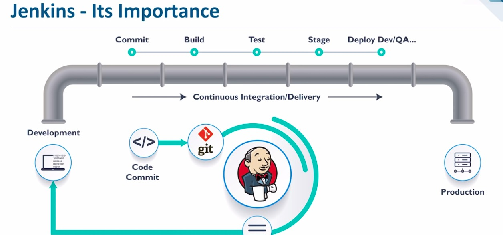

# SRE INTRO
## User Journey
### User Experience
#### Cloud Computing with AWS
##### AWS Services
- Create Github Repo to push the markdown Doc
- Amazon Web Services (AWS)

### Benefits of Cloud Computing
- Ease of Use
  - Comes with AWS Tools
  - Able to migrate from other Servers to the Service
  - Able to deploy in a time manner from a Remote Location rather than needing to be on site
- Flexible
  - Able to choose how and where you want to run workloads such as choosing the region
  - Able to run small Servers or bigger Servers on demand
  - A virtual environment that lets you load the software easily
- Fast & Robust
  - Scalable and Reliable
  - Fully Redundant 100GBE FIber
  - Fully Isolated partitions (Able to isolate issues and achieve high availbility consistently)
- Cost
  - Only pay for what you use (Computing, Storage and Other Resources)
  - No Long Term Contracts or Up-Front Commitments
  - Migration and Deployments are eased by the Tools, therefore costs cheaper

### What is the role of SRE
- Automate Tasks as much as Possible
- Monitor the System, Predict possible points of Failure that can happen in the future in the System
- Fix the Issues that pop up immediately
### Benefits of Cloud Computing
- Cost Savings, Flexibility, Strategic Value
### AWS
- Amazon Warehouse Storage
- 84 Availability Zones with 26 Total Regions around the world
### AWS Global Infrastructure
- Global & Flexible
- Highly Available & Scalable
- Secure and Highly Performance
### Regions vs Availability Zones
- Regions are multiple isolated locations within each Region (Paris could contain 5 Nodes spread out in the City)
- Regions consist of multiple Availability Zone
- Allows multiple instances where each Instance can be in different Zones to allow for High Uptime
### What are the four Pillars of Cloud Computing
- Ease of use
  - Allows for quick and secure hosting of applications
- Flexibility
  - Allows you to pick the location of the servers online and can be switched to different regions or be active in different regions at the same time with CDN
- Robustness
  - Auto Scaling allows multiple copies and more servers to be added depending on the demand
- Cost effective
  - You only pay for what you use
### What is CDN
- Content Delivery Network
- Deploying it to a Server in England
- The Service will also deploy a copy to another Server in a different region to ensure that it has Global Access
### On PREM VS Hybrid - On PREM VS Public Cloud
- Private Cloud
  - Cloud Computing that is solely dedicated to your organizatin
  - Dedicated and Secure
  - Efficient
- Public Cloud
  - Cloud Computing that is shared across Organizations
  - No Maintanence Costs
  - Agile for Innovation
- Hybrid
  - Any environment that uses Both Public and Private
  - Policy Driven
  - Workload Diversity therefore High Reliability

### Localhost
- file.pem
- ssh folder
Public Cloud
- Secure the Security Groups
- AWS File.pem is the file shared
- SSH Command Provided to use AWS
AWS IAM Role
- Middle Man Role in order to give the LocalHost an access point to the Cloud

### AWS VM Connection Diagram

- File.Pem
  - Privacy Enchanced Mail
  - Used to Represent Keys, Certificate Requests & Chains
- .SSH Folder
  - Secure Socket Shell
  - Uses port 22
  - A network protocol that gives System Admins a secure way to access a Computer over a network
- AWS IAM
  - Identity and Access Management
  - Defines a set of permissions for making AWS Service Requests
  - Not Associated with a specific User Group
    - Instead Assumes Roles such as IAM users, apps or AWS services such as EC2
- EC2
  - Elastic Compute Cloud
  - Providing Scalable Computing Capacity
  - Enables faster development and Deployment due to lack of need of physical hardware
  - Able to configure security, networking, cookie management and launch virtual servers all from a dashboard


### AWS Instance & Connecting to it 
- Choose an EC2 Instance
- Select the Ubuntu 18.0.4 Selection
- Choose Default Free Tier Eligible
- Choose Default A as the Subnet
- Add Storage (We skip for our purposes)
- Within the Keys and Values Tag, Type out 105_SRE_MingKen_(purpose)
- Configure Security Group
  - SSH = My Ip
  - HTTP = Anywhere
  - HTTPS = Only with SSL Certificate
- Review Instances and Launch
- SSH within the Keys Perm Folder
- Connect with the SSH Command
- Once Connected, Use these Commands in Order to get the latest updates
  - sudo apt-get update -y
  - sudo apt-get upgrade -y
- You are ready to go and you can install whatever packages you want


### Linux Commands
- How to start a Service
  - sudo systemctl start name_service
- How to stop a service
  - sudo systemctl stop name_service
- How to check status 
  - systemctl status name_service
- how to enable service
  - systemctl enable name_service
- How to install a package
  - sudo apt install package_name -y
- How to remove a package
  - sudo apt remove package_name -y
- how to check all process
  - top
- Who am I 
  - uname
  - uname -a
- Where am i?
  - pwd
- Create a directory
  - mkdir dir_name
- How to check current files and directory
  - LS
  - LS -a
- How to create a File
  - touch name_file
  - nano name_file
- How to check content of a file without going inside the file
  - cat > filename
  - cat filename
- How to move a file to another folder
  - mv file_name  ~/folder
- How to move back
  - cd ..
- How to delete folder 
  - rm -rf folder_name


### File Permissions
- How to check file permissions
  - ll
- Change File permission
  - CHMOD require_permission file_name
  - SUDO Chmod 400 SRE.txt
- Make a file executable
  - sudo chmod +x file_name.sh
- https://chmod-calculator.com/

### Bash Scripting - Automate processes with a script
```bash
#!/bin/bash

# Run Updates
sudo apt-get update -y

# Run Upgrades
sudo apt-get upgrade -y

# Install NGINX
sudo apt-get install nginx -y

# Ensure its running - Start NGINX
sudo systemctl start nginx

# Enable NGINX
sudo systemctl enable nginx
```

  - Change the file to exe `chmod +x provisions.sh`
  - To run the File `sudo ./provisions.sh`
    - The sudo within this command is really only for security

### TomCat Installation
```bash
#!/bin/bash

#TomCat Installation

#1 Install Java JDK Environment
sudo apt install default-jdk

#2 Setting up a TomCat User Profile
sudo useradd -r -m -U -d /opt/tomcat -s /bin/false tomcat

#3 DownLoad the TomCat Package using Curl
sudo apt install curl
curl -O https://dlcdn.apache.org/tomcat/tomcat-9/v9.0.60/bin/apache-tomcat-9.0.60.tar.gz

#4 Installing Tomcat
sudo mkdir /opt/tomcat
tar -xf apache-tomcat-9.0.60.tar.gz
sudo mv apache-tomcat-9.0.60 /opt/tomcat/
sudo ln -s /opt/tomcat/apache-tomcat-9.0.60 /opt/tomcat/latest

#5  Provide the TomCat User Profile Access to the Directory
sudo chown -R tomcat: /opt/tomcat/

#6 CHMOD to Add the executables within the Bin Directory
sudo sh -c 'chmod +x /opt/tomcat/latest/bin/*.sh'
```

- 2nd Part but not a script
```
#7 After ensuring that the Java Installation is Correct, reload the Daemon
sudo systemctl daemon-reload

#8 Allow Port 8080 through the firewall to access Tomcat
sudo ufw allow 8080/tcp

#9 Start Tomcat
sudo systemctl start tomcat
```


  - After adding this script use this command on the file `chmod +x tomcat.sh` and `chmod +x tomcat2.sh`
  - Run the file with `sudo ./tomcat.sh`
  - Ensure that the Java Home Directory is correct first with the first Part of the Instalation
    - `sudo nano /etc/systemd/system/tomcat.service`
  - And Add to the Nano
    - 
  ```
[Unit]
Description=Tomcat 9.0 servlet container
After=network.target
[Service]
Type=forking
User=tomcat
Group=tomcat
Environment="JAVA_HOME=/usr/lib/jvm/default-java"
Environment="JAVA_OPTS=-Djava.security.egd=file:///dev/urandom"
Environment="CATALINA_BASE=/opt/tomcat/latest"
Environment="CATALINA_HOME=/opt/tomcat/latest"
Environment="CATALINA_PID=/opt/tomcat/latest/temp/tomcat.pid"
Environment="CATALINA_OPTS=-Xms512M -Xmx1024M -server -XX:+UseParallelGC"
ExecStart=/opt/tomcat/latest/bin/startup.sh
ExecStop=/opt/tomcat/latest/bin/shutdown.sh
[Install]
WantedBy=multi-user.target      
```
  - Connect to TomCat with your IP Address and add ":8080" to the end

- What is a VPC
  - Virtual Private Coud
  - A virtual network dedicated to your account on the Service
  - Private instance that is Secure and Isolated within a Public Cloud
  - Store Data
  - Run Code
  - Host Websites
- What is an Internet gateway
  - A Horizontally scaled, redundant and highly available VPC component
  - Allows Communicatins between your VPC and the Internet
  - Enables the resources like EC2 Instances to connect to the internet if they have a public IPV4 or 6 Address


- What is route tables
  - A set of rules called rooutes that determine where network traffic from your subnet or Gateway is directed
  - local route for communication within the VPC


- What is a subnet
  - A range of IP Addresses in your VPC
  - Dividing the Network into  two or more networks
  - Public and Private Subnets exist
- What is NACLS
  - Network Access Control List
  - Optional Security Layer
  - Acts as  Firewall for controlling traffic in and out of one more subnets
- What is a Security Group
  - A Virtual Firewall that controls Traffic
  - Decides what traffic leaves and reaches the resources it is associated with
  - Such as Our EC2 Instance where our security group we needed to add 8080 to the Ports in order to access TomCat
- How did you secure your app on the public cloud
  - By using Security Groups and allowing only ports we know that are Safen and Frequently Used
  - Such as acessing TomCat a safe port we allow only 8080 to leave and reach the instance
  - Doing this, we restrict whether traffic can enter or leave the isntacnce thereby securing
- WHat are the outbound rules for security Group by default? and why?
  - Default is All inbound traffic from resources that are assigned to the same security Group
  - Allows all outbound IpV4 Traffic
  - Allows all Outbound IPV6 Traffic if VPC has an associated IPv6 Block
- What is the command to kill a process in Linux?
  - Kill ProcessID
  - SigKill ProcessID / Kill-9 ProcessID


### Monolith - N-Tier - 2Tier & Microservices Architecture

- CICD Pipelines
  - Continous Intergration
    - Developers Merge/Commit Code to Main Branch a few times a day
    - These are fully automated Builds that are automatically tested
    - Avoids integration hell
  - Continous Delivery
    - A Sustainable way of releasing your changes publicly
    - Deployment is completed manually
    - Extended further upon Continous Integration
  - Continous Deployment
    - No Human intervention is Deployment
    - Only a failed test will prevent Deployment
    - One Step further than continous Delivery


- Microservices
  - Services that can be added to the Code On demand


- Jenkins
  - A Pipeline interface to allow simpler planning


- Docker
  - Software that allows us to containerise apps and code

### SDLC
Software Development Life Cycle
- Planning
  - An Idea
- Designing
  - Writing out how the product will look
  - What the product needs
- Development
  - An environment that works for all of us regardless of OS
- Testing
  - Nothing goes to production without testing
  - Must pass in order to go to the next stage
  - Can get Feedback
- Staging
  - Holding Area before the code gets deployed

### Github
- One person reviewing is always the best
- Someone who is more knowledgeable should merge
- Git Enter gives all the available command
- If you delete the .git you need to reconnect to the github remote before pushing the code back


### Docker

- An Open Source Containerization platform.
- Allows Developers to package applicatins into Containers.


- When compared to a VM, we have Unified Memory and only have the dependencies needed to run the Application rather than requiring an OS

`docker images:` Present the downloaded Images Available

`docker ps`: Current Running Containers

`docker ps -a`: To check every container running including hidden files

`docker pull`: Pull the image from Online Hub

`docker exec -it [container id] bash`: To Access the Specified Container ID

`docker stop`: Stops the Currently Running Container with a Grace Time

`docker kill`: Kills Container Immediately 

`docker commit [container id][username/imagename]`: Creates a new Image of a Container running on the Local System on the online Repo

`docker rm [container id]`:Removes Specified Container

`docker history [image name]`: View History

`docker image rm [image name]`: Delete Specified Image

`docker exec -it "Container ID`: Enter the Specified Container

`docker run -d -p localhost-port:container-port` : Port mapping in our containers with localhost

`docker cp "File Location" "Second File Location"` : Docker Command from this Location to another Location

`docker commit "Container ID" "Repo with Version Tag"`: Docker commit to the Repo with the Version

`docker run -d -p 80:80 mingkennn/sparta_sre:v1` : Download and run the Image Version v1 at Port 80

##### Docker Volumes

- Directories and Files that exist on the host file system outside of the Docker Container
- Used to Persist and share Data between Containers
- Supports Mounting of one more data volumes from the Host OS to the Container


